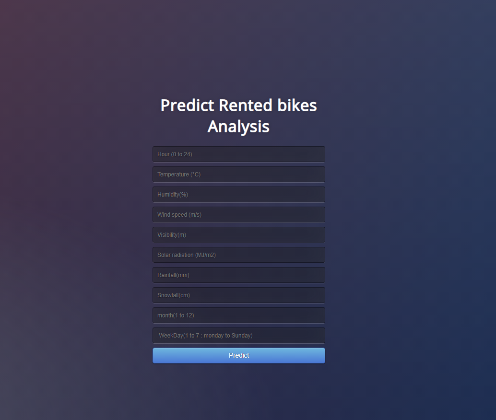

# Seoul Bike Rental Demand Analysis

## Introduction

Currently, rental bikes are introduced in many urban cities to enhance mobility comfort. The goal of this movement is to modernize cities and encourage people to move towards a greener world. Let's take the example of Paris in 2007, where "velibs" were introduced, and Amsterdam, where there are more bikes than cars. The aim is to facilitate commuting in Seoul and reduce the number of cars and pollution. Indeed, the development of new commuting options has reduced the use of cars for work and city visits.

It is important to make rental bikes available and accessible to the public, as they provide many alternatives for commuters in large cities. There are many advantages to bike rentals; they are convenient because they allow people not to keep the bike all day long, whether at work or school. Furthermore, biking is the healthiest way to travel and has many environmental benefits.

## Study Objective

The studied dataset contains weather information which are the features (Temperature, Humidity, Wind speed, Visibility, Dew point, Solar radiation, Snowfall, Rainfall), and the target is the number of bikes rented per hour based on the date. The dataset spans from December 1st, 2017, to the same day one year later.

### Research Question

How many bikes are rented per hour based on weather conditions?

The goal of the Seoul Bike company is to provide the city with a stable supply of rental bikes. It becomes a major concern to keep users satisfied. The crucial part is predicting the bike rental count at each hour for a stable supply of rental bikes. We believe that this study could be reported to the company 'Seoul Bikes'. We think it could help them know if they need to supply more bike stations in the city in order to maintain good customer satisfaction.

You can find the dataset necessary for the analysis at the following link: [Seoul Bike Sharing Demand Dataset](https://archive.ics.uci.edu/ml/datasets/Seoul+Bike+Sharing+Demand#).

## Project

This project is implemented in Python and includes the following tasks:

- **Data Visualization**: Showing correlations between the data and the target in a Jupyter Notebook.
- **Machine Learning Model**: Building a predictive model in a Jupyter Notebook.
- **Model Transformation into an API**: Using Flask to deploy the model.

You will find in this repository:

- A LaTeX report of the study.
- The Jupyter Notebook with the analysis.
- The transformation of the model into an API.

## Conclusion

This study shows that bike rentals are influenced by a variety of features. From the analysis, we found that many Koreans usually rent bikes during weekdays, suggesting that the main use is for commuting to school or work. There are also several conditions contributing to the variation in rental numbers, such as the day of the week, the time of the day, and weather conditions. Weather conditions are especially important, as more bikes are rented during the spring and summer. As expected, more people are likely to rent bikes when the weather is favorable.

You can check below the result of the deployment of our machine learning model: the Extra Trees Regressor, which had the best score among the tested models.

